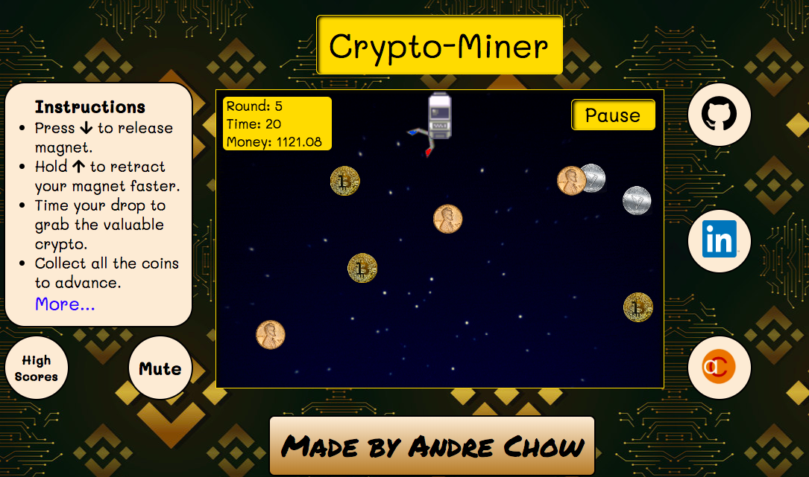

# Crypto-Miner
A browser-based game, made with Javascript.

## Background
* Crypto-Miner is a classic game of gathering money with the added twist of cryptocurrencies replacing gold.
* You control a computer miner who sends out his magnet to grab the precious cryptos, if you time it correctly. 
* The objective of this game is to collect all the coins for each round in order to progress.
* The amount of money each cryptocurrency is worth will fluctuate between each round to simulate how real life crypto prices can vary from second to second. 
* Prices are calculated by using Math.random() multiplied by the specific multiplier for that coin plus their base value. 
* With each completed round, you get back 15 seconds. 
* You are in a race to see how many rounds you can complete before you run out of time!

## Features
With Crypto-Miner, users are able to:
- [ ] Start, pause, and reset the game
- [ ] Release the magnet with DOWN key
   - [ ] The magnet will move back and forth, in a semi-circle
- [ ] Retract the magnet with UP key
- [ ] Mute the sound, using a button on the side
- [ ] Toggle instructions panel on the side for more info

## Technologies, Libraries, APIs
This project is implemented with the following technolgies: 
* `JavaScript` for handling of game logic
* `jQuestion` for manipulation of DOM elements
* `Canvas` for drawing of game features
